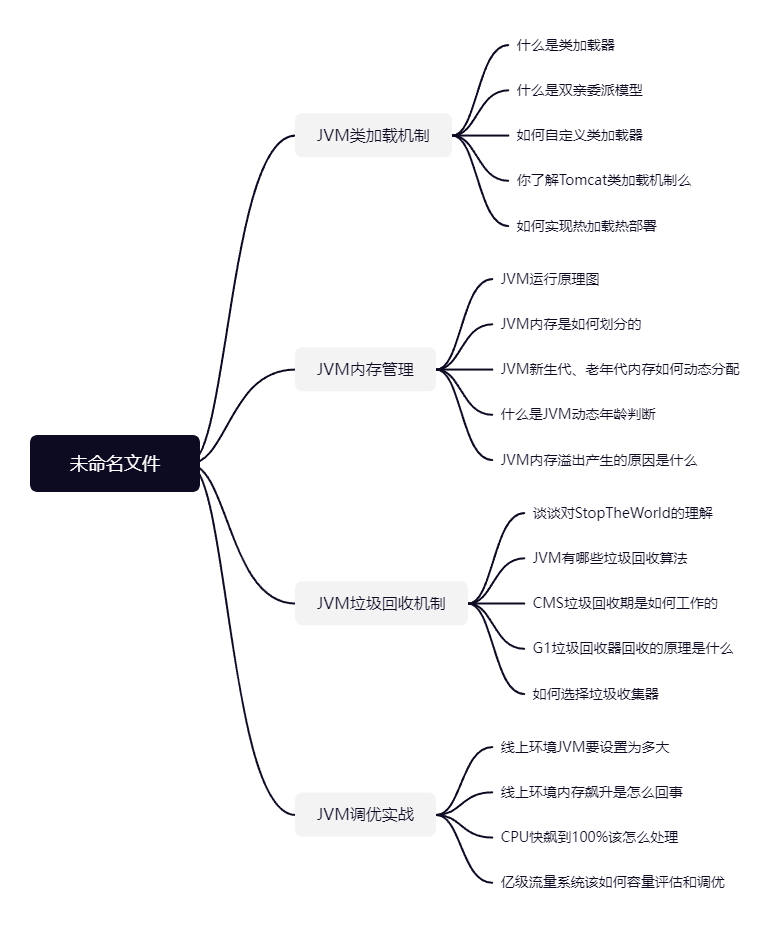

### CAP定理是什么？

C（Consistency）：一致性，是指

A（Available）：

P（Partition）：

### BASE理论是什么？

BA（Basically Available）：

S（Soft state）：

E（Eventually consistent）：

### 两阶段提交协议（2PC）是什么？

两阶段提交是为了分布式节点上的多个单节点事务组成一个分布式事务，并通过一个协调者（Coordinator）来决定分布式事务的提交或回滚。
两阶段提交的前提是每个执行分支都具备ACID性质、都有redolog和undolog表且节点之间可以通信。

两阶段分别指<u>**准备阶段**</u>，<u>**提交（或回滚）阶段**</u>，第一阶段则是单个节点进行准备，每个节点自检是否可以提交，然后报告协调者。如果协调者收到任何一个无法提交或者在规定时间内无法收到每个节点的报告，则回滚。

### 2PC协议有什么缺点？

1. 同步阻塞问题：当在第一阶段准备时候，每个节点只执行sql不提交，则会占用资源，导致其他服务无法使用数据库资源。

2. 单点问题：如果协调者向发出commit指令过程中，协调者宕机了，则部分参与者接受了commit指令提交了本地事务，而部分参与者未接收到指令则未提交事务，此时整个分布式系统产生了数据不一致现象。

3. 无法解决的问题：当协调者发出commit指令之后宕机了，某个参与者接收到消息之后也宕机了，此时，即便重新选举了新的参与者，那么整个分布式事务的状态也处于未知状态。

如何解决？

### 3PC协议是什么？

分别是CanCommit、PreCommit、DoCommit

CanCommit：协调者询问参与者是否可以参与事务，并等待参与者回应。

2.

PreCommit

# JVM

## 类加载机制

### 谈谈对类初始化的理解？

- 静态变量在初始化阶段赋值，在准备阶段值为null
- 变量在初始化阶段是空的，创建对象时候才赋值
- 代码块，在创建对象时候才会被执行

### 继承时候，父子类的执行顺序是怎么样的？

父类静态变量 -> 父类静态变量 -> 子类静态变量 -> 子类静态代码块

### 谈谈对类加载器的理解？

在类“加载”阶段，通过类的全限定名来获取描述该二进制字节流的这个动作的“代码”被称为“类加载器”（Class Loader），这个动作可以自定义实现。

### JVM有哪些类加载器，分别有什么作用？

- BootStrapClassLoader， 使用C++实现，虚拟机自身的一部分
    - 加载<JAVA_HOME>/rt.jar、resources.jar、charsets.jar中的类
    - 被-Xbootpath参数指定的路径的类
- ExtClassLoader，扩展类加载器
    - 加载<JAVA_HOME>/jre/lib/ext目录下的类
    - 加载被java.ext.dirs参数指定的路径中类库
- AppClassLoader，加载用户编写的类

### JVM中三个类加载器有继承父子关系么？

这三个类不存在继承关系。BootstrapClassLoader是C++编写，而ExtClassLoader和AppClassLoader则是Launcher的内部类。三个类都继承与ClassLoader这个类。

### 谈谈对双亲委派模型的理解？

总结：自底向上检查是否加载成功，自顶向下尝试加载。

### 谈谈对CMS的理解？

### 谈谈对G1的理解？

### 谈谈对JVM堆分代设计的理解？

### JVM常用命令有哪些？

- jps
- jinfo
- jstack
-

### 垃圾收集器如何分类的？

- 串行收集器：Serial和Serial Old，只能有一个垃圾回收线程，用户线程会暂停，适用于小型嵌入式设备。
- 并行垃圾收集器【吞吐量优先】：Parallel Scanvenge, Parallel Old，多线程回收期并行工作，但用户线程仍然会暂停，适用于科学计算、后台计算等。
- 并发垃圾收集器【停顿时间优先】：CMS，G1，ZGC，用户线程和垃圾回收器线程并发执行，不会暂停用户程序，适用于Web等响应时间敏感的场景。

